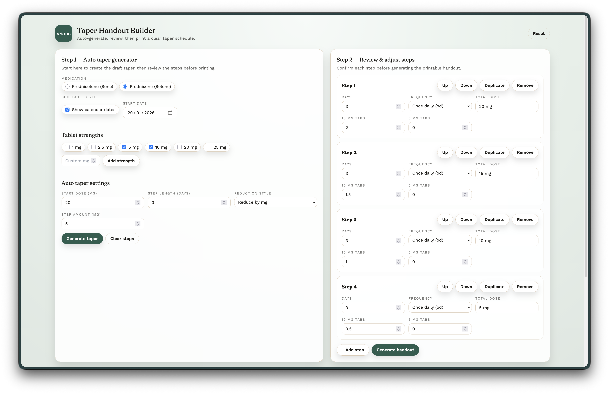
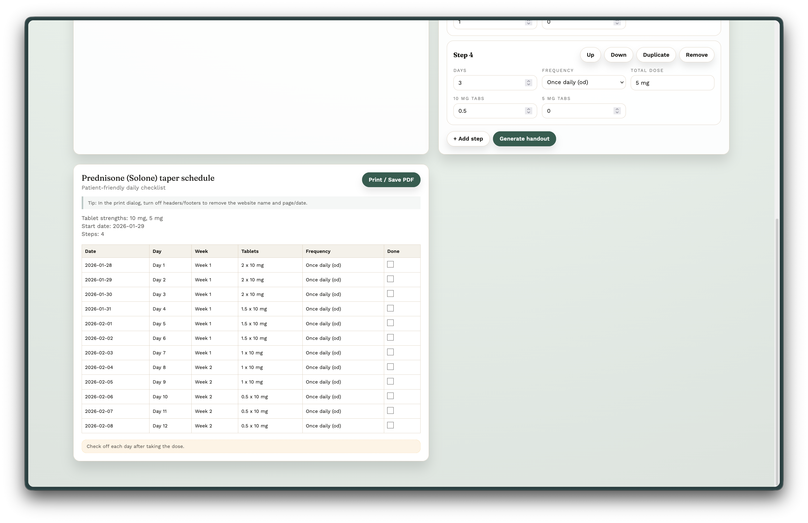
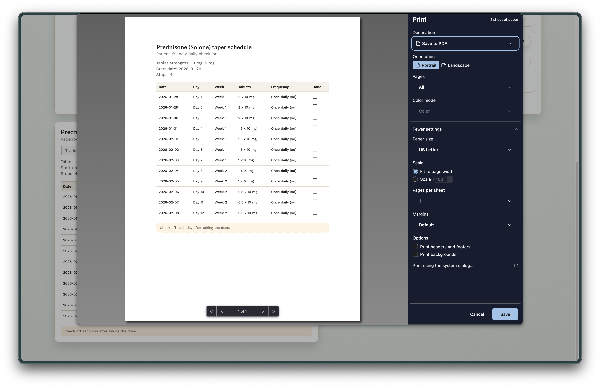

# xSone Taper Handout Builder

A pharmacist-friendly, client-side web app for creating clear prednisone/prednisolone taper schedules that are easy to follow and print.

## Why this exists
Medication labels can become long and confusing when tapers are complex. This tool creates a clean, day-by-day handout with checkboxes so patients can track progress without decoding a label.

## Features
- **Auto taper generator** with configurable step length and reduction style.
- **Manual review/edit** of every taper step before generating the handout.
- **Printable output** with minimal ink usage and a checkbox for each day.
- **Date or dateless** schedules (calendar dates optional).
- **Prednisone, prednisolone, or dexamethasone** selection (Solone/Sone).
- **Multiple tablet strengths** supported with custom strength entry.

## Screenshots

### Step 1 — Auto taper setup


### Step 2 — Review & adjust steps


### Final handout preview


## Local development

```bash
npm install
npm run dev
```

## Build

```bash
npm run build
```

Build output is written to `dist/`.

## Deploy (GitHub Pages)
1. Set the Vite `base` if the repo is deployed under a subpath. For this repo:

```ts
// vite.config.ts
export default defineConfig({
  base: "/xSoneTaperHandoutBuilder/",
});
```

2. Build and deploy the `dist/` folder with your preferred GitHub Pages workflow.

## Printing tips
- Use the **Print / Save PDF** button.
- In the browser print dialog, **disable headers/footers** to remove the URL and page/date.

## Notes
This tool does not store patient data and runs entirely in the browser.
